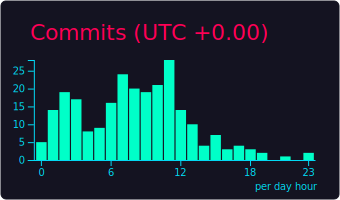

<div align="center">

# Hi there! 👋 I'm Xiaodong Ye (R0CKSTAR)

### 🚀 AI Infrastructure Engineer & Open Source Enthusiast


[](https://github.com/yeahdongcn?tab=followers)
[](https://www.linkedin.com/in/yeahdongcn/)
[](https://huggingface.co/yeahdongcn/)

<!-- Cyberpunk 2077 themed banner from profile summary cards -->


</div>

---

## 🎯 About Me

```python
class yeahdongcn:
    def __init__(self):
        self.name = "Xiaodong Ye (R0CKSTAR)"
        self.role = "AI Infrastructure Engineer"
        self.company = "MooreThreads"
        self.location = "Beijing, China 🇨🇳"
        self.expertise = [
            "AI & Machine Learning Infrastructure",
            "Cloud Native Technologies",
            "Virtualization & GPU Clusters",
            "iOS/macOS Development",
            "LLM Orchestration & Optimization"
        ]

    def current_focus(self):
        return [
            "Building scalable GPU clusters for AI workloads",
            "Developing AI agent tools with Agentman",
            "Kubernetes orchestration for LLMs",
            "Contributing to Ollama MUSA integration",
            "Open source AI infrastructure tools"
        ]

    def get_achievements(self):
        return {
            "github_stars": "2000+",
            "github_followers": "333+",
            "github_repos": "244+",
            "github_program": "Developer Program Member",
            "career_path": ["VMware", "Sangfor", "MooreThreads"],
            "specialties": ["Swift", "Python", "Go", "Kubernetes", "CUDA"]
        }
```

---

## 🛠️ Tech Stack & Tools

### Languages & Frameworks
<div align="center">

[](https://www.python.org/)
[](https://golang.org/)
[](https://swift.org/)
[](https://developer.mozilla.org/en-US/docs/Web/JavaScript)

</div>

### Cloud & Infrastructure
<div align="center">

[](https://kubernetes.io/)
[](https://www.docker.com/)
[](https://www.vmware.com/)
[](https://aws.amazon.com/)

</div>

### AI & Development Tools
<div align="center">

[](https://tensorflow.org/)
[](https://pytorch.org/)
[](https://ollama.ai/)
[](https://git-scm.com/)

</div>

---

## 🏆 Featured Projects

<div align="center">

<table>
<tr>
<td width="50%">

### 🤖 [Agentman](https://github.com/yeahdongcn/agentman)
**AI Agent Development Tool**

[](https://www.python.org/)
[](https://github.com/yeahdongcn/agentman/stargazers)

Tool for building and managing AI agents with Docker integration

</td>
<td width="50%">

### 🚀 [Ollama-MUSA](https://github.com/MooreThreads/ollama-musa)
**LLM Runtime with MUSA Support**

[](https://golang.org/)
[](https://github.com/MooreThreads/ollama-musa/stargazers)

Get up and running with OpenAI gpt-oss, DeepSeek-R1, Gemma 3 and other models on MUSA.

</td>
</tr>
<tr>
<td width="50%">

### 🦙 [MaKllama](https://github.com/makllama/makllama)
**Kubernetes + LLM Orchestration**

[](https://golang.org/)
[](https://github.com/makllama/makllama/stargazers)

Running LLMs on Kubernetes with macOS nodes

</td>
<td width="50%">

### ⚒️ [Kustohelmize](https://github.com/yeahdongcn/kustohelmize)
**Helm Chart Generator**

[](https://golang.org/)
[](https://github.com/yeahdongcn/kustohelmize/stargazers)

Generate Helm Charts from Kustomize configurations

</td>
</tr>
<tr>
<td width="50%">

### 🎨 [UIColor-Hex-Swift](https://github.com/yeahdongcn/UIColor-Hex-Swift)
**iOS Color Utility**

[](https://swift.org/)
[](https://github.com/yeahdongcn/UIColor-Hex-Swift/stargazers)

1.2K+ stars - RGBA hex string color utility for iOS

</td>
<td width="50%">

### 📱 [RSBarcodes_Swift](https://github.com/yeahdongcn/RSBarcodes_Swift)
**Barcode Reader & Generator**

[](https://swift.org/)
[](https://github.com/yeahdongcn/RSBarcodes_Swift/stargazers)

1D and 2D barcodes reader and generators for iOS 8

</td>
</tr>
</table>

</div>

---

## 📊 GitHub Analytics

<div align="center">


</div>

<div align="center">


<!-- Cyberpunk 2077 additional cards -->



</div>

---

## 📈 Recent Activity

<div align="center">

<!--START_SECTION:activity-->
🎯 **Latest Contributions (August 2025):**
- 🚀 Major updates to MooreThreads/ollama-musa with improved MUSA GPU stability
- 🤖 Agentman: new agent templates, better Dockerfile instruction coverage, and base image refresh
- 🦙 MaKllama: multi-node scheduling improvements for LLM workloads on macOS nodes
- ⚡ Kustohelmize: faster chart generation and better Kustomize edge-case handling
- 🧪 Added CI checks and linting rules across repos; stabilized pipelines
- 📦 Published minor releases across Go/Swift utilities and Python tooling
- 🎮 Personal: grabbed a PS5 — currently vibing in Night City (Cyberpunk 2077)
<!--END_SECTION:activity-->

</div>

---

## 🌟 Professional Highlights

<div align="center">

| 🏢 **Current Role** | 🎯 **Expertise** | 🌐 **Community** |
|:---:|:---:|:---:|
| AI Infrastructure Engineer<br/>@ **MooreThreads** | GPU Clusters<br/>Cloud Native<br/>Virtualization<br/>LLM Optimization | GitHub Developer<br/>Program Member<br/>📝 [333+ Followers](https://github.com/yeahdongcn?tab=followers)<br/>📦 244+ Repositories |

</div>

### 🎖️ GitHub Achievements
<div align="center">

[](https://archiveprogram.github.com/)
[](https://github.com/yeahdongcn)
[](https://github.com/yeahdongcn)
[](https://github.com/yeahdongcn)
[](https://github.com/yeahdongcn)

</div>

---

## 🤝 Let's Connect

<div align="center">

I'm always interested in discussing **AI infrastructure**, **cloud native technologies**, and **open source contributions**. Feel free to reach out!

[](mailto:yeahdongcn@gmail.com)
[](https://www.linkedin.com/in/yeahdongcn/)
[](https://huggingface.co/yeahdongcn/)

**💡 Open to collaborating on:**
- AI/ML infrastructure projects
- Cloud native solutions
- Open source tools
- iOS/macOS applications

</div>

---

<div align="center">

[](https://github.com/yeahdongcn)

*⭐ From [yeahdongcn](https://github.com/yeahdongcn) - Building the future of AI infrastructure, one commit at a time*

</div>
